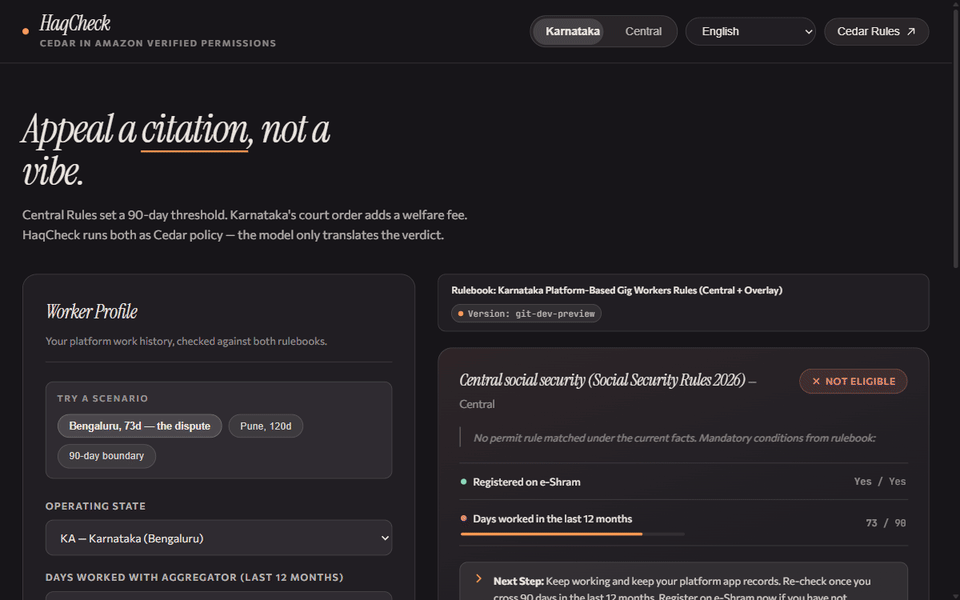

<div align="center">

<div align="center">
  
</div>

---

## What it is

Gig workers in India are currently caught between overlapping and confusing sets of rules:

- **Central Government Rules (2026):** Requires working 90 days on a single app to get benefits.
- **Karnataka State Rules (2026):** Requires apps to pay into a separate welfare fund.

It is nearly impossible for an average worker to know which rule applies to their specific situation. **HaqCheck** solves this by taking a worker's basic details (like days worked and location) and calculating exactly what they are eligible for.

Instead of relying on AI to guess the law, HaqCheck uses a deterministic rules engine to cite the exact legal statute, and then uses AI solely to translate that legal verdict into simple, plain language (English, Hindi, or Kannada) so workers can easily understand their rights.

## How it works (Under the hood)

To ensure we **never** give false legal advice, the architecture is strictly separated into two parts:

**The Rules Engine decides. The AI only explains.**

1. **Strict Rules (Cedar):** The actual laws are written into hardcoded policies (using Cedar and Amazon Verified Permissions). This acts as the "judge" and makes a 100% accurate YES or NO decision based on the law.
2. **AI Translation (Amazon Bedrock):** Once the rules engine makes a decision, we pass that decision to an AI. The AI's *only* job is to translate that legal verdict into plain language that the user can understand. It is strictly blocked from making up rules or changing numbers.
3. **Frontend & Backend (AWS):** An easy-to-use web app powered by AWS serverless technology connects everything together.

<p align="left">
  <a href="https://aws.amazon.com/verified-permissions/"></a>
  <a href="https://aws.amazon.com/lambda/"></a>
  <a href="https://aws.amazon.com/api-gateway/"></a>
  <a href="https://aws.amazon.com/dynamodb/"></a>
  <a href="https://aws.amazon.com/bedrock/"></a>
  <a href="https://aws.amazon.com/amplify/"></a>
</p>

| AWS Service                                   | Component & Architecture Role                                                                                                                         |
| :-------------------------------------------- | :---------------------------------------------------------------------------------------------------------------------------------------------------- |
| **Amazon Verified Permissions** (Cedar) | Evaluates eligibility deterministically using strict Cedar policy sets (`central` and `karnataka`) with exact `@source` legal clause citations. |
| **AWS Lambda**                          | Python 3.12 serverless handlers (`/evaluate` and `/explain`) scaling to zero with on-demand invocation.                                           |
| **Amazon API Gateway** (HTTP API)       | High-throughput, low-latency API gateway routing client evaluation and explanation requests with CORS enabled.                                        |
| **Amazon DynamoDB**                     | On-demand table (`CasesTable`) storing immutable ruleset versions (`RULESET#<rb>`) and case determination logs with TTL.                          |
| **Amazon Bedrock** (Nova Lite)          | Converts structured Cedar verdicts into plain-language summaries (English, Hindi, Kannada) through Strands Agents SDK with strict digit guardrails.   |
| **AWS Amplify Hosting**                 | Continuous integration and global CDN hosting for the Vite/React single-page application.                                                             |

Everything scales to zero. Weekend cost: **under $1**, excluding Bedrock calls.

## Try it

🌐 **Live Application (AWS Amplify):** **[https://main.duuh4vgnn5xa3.amplifyapp.com/](https://main.duuh4vgnn5xa3.amplifyapp.com/)**

API Endpoint: `https://wi73sdx8ib.execute-api.ap-south-1.amazonaws.com`

---

## Testing Locally

If you want to run and test HaqCheck on your local machine, follow these steps:

### 1. Backend Setup

```bash
cd backend
# Create and activate a virtual environment
python -m venv .venv 
.venv\Scripts\activate   # On Windows
# source .venv/bin/activate  # On macOS/Linux

# Install dependencies
pip install -r requirements-dev.txt

# Run unit tests (No AWS credentials needed)
python -m pytest -v
```

If you want to deploy the backend to AWS for live testing:

```bash
python scripts/create_stores.py    # Run once to create AVP stores
sam build && sam deploy            # Requires AWS credentials
python scripts/sync_policies.py    # Pushes Cedar policies to stores
python scripts/run_tests.py        # Runs tests against live AVP
```

### 2. Frontend Setup

```bash
cd ../frontend
npm install

# Copy the example environment file
cp .env.example .env
# Important: Update VITE_API_BASE in .env to the ApiUrl output from the SAM deployment (or the live endpoint)

# Start the local development server
npm run dev
```

<details>
<summary><b>Legal sources & disclaimer</b></summary>

- Social Security (Central) Rules, 2026 — gazetted 8 May 2026; 90-day (single aggregator) work threshold and e-Shram/Shram Suvidha registration for gig/platform workers. Exact rule number not confirmed against the primary gazette text; encoded from consistent secondary reporting (Medianama, Business Standard, JSA, Lexology).
- *Internet and Mobile Association of India (IAMAI) & Ors. v. State of Karnataka & Ors.*, Karnataka High Court, interim order dated 4 July 2026 (Justice M Nagaprasanna) — directed Swiggy, Zomato (Eternal Ltd), Zepto and Urban Company to deposit the welfare fee under the Karnataka Platform-Based Gig Workers (Social Security and Welfare) Act, 2025. Case/WP number not confirmed against the primary order; encoded from consistent secondary reporting (BusinessToday, Bar & Bench, Medianama, LiveLaw).

**TODO before submission:** obtain and cite the primary gazette text and court order directly (Task 0 Step 3 of the plan); if still unavailable, the `@confidence("secondary-source")` annotations already shipped are accurate and stay as-is.

**Disclaimer:** HaqCheck is an eligibility estimate with citations, not legal advice. The rulebook version is shown in the app footer.

</details>

## Built for WeMakeDevs × AWS Bharat Builds Tour

Stop 01, "First Commit" — 17–20 Sept 2026, Bangalore.

### 📝 Architecture Article (AWS Builder Center)

Read the full technical deep dive and build log published on AWS Builder Center:
👉 **[Cedar Decides. The LLM Just Talks.](https://builder.aws.com/content/3JUK7jCVjwlCkjniq3MelEzflJU/cedar-decides-the-llm-just-talks)**
👉 **[Cedar Decides. The LLM Just Talks.](https://builder.aws.com/post/3JUNNe3oGijmQnWBcDKmTZf6lia_p/cedar-decides-the-llm-just-talks)**

<details>
<summary><b>AI tools used (hackathon rule 03)</b></summary>

Claude Code (Anthropic) was used for web Search, code generation and review. All Cedar policies were hand-authored against the sources above (with citation research done via web search, not generated by a model); the underlying facts were verified before the policies were written, not invented by the model.

Idea was given by my mind:) not any AI

</details>

<div align="center">
<br>
<b>HaqCheck</b> — your haq, cited.
</div>
