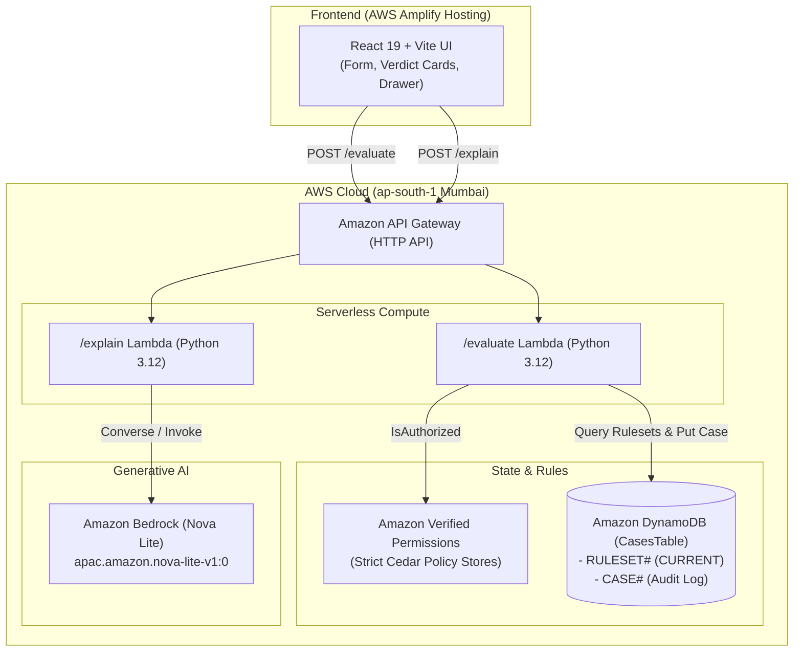

# Inception Baseline: HaqCheck (हक़Check)

> **Baseline Version:** 1.0.0  
> **Date:** 2026-09-18  
> **Project:** HaqCheck — your haq, cited.  
> **Target Event:** WeMakeDevs × AWS Bharat Builds Tour (Stop 01 "First Commit") — "Ship It" Track

---

## 1. Problem Statement

Gig and platform workers in India face confusing, overlapping social security regulations:
- **Social Security (Central) Rules, 2026:** Mandates a 90-day single aggregator work threshold and e-Shram registration for central welfare benefits.
- **Karnataka High Court (July 2026):** Directed aggregators (Swiggy, Zomato, Zepto, Urban Company) to deposit welfare fees into a state fund for gig workers in Karnataka.

Existing tools act as directories rather than deterministic verifiers. HaqCheck provides deterministic eligibility determination powered by **Cedar** in **Amazon Verified Permissions (AVP)** with exact legal citations, paired with an LLM that only explains the verdict and is guarded from hallucinating numbers.

---

## 2. System Architecture

---

## 3. Core Components

1. **Cedar Policy Engine & AVP Stores (`policies/`):**
   - Two policy stores: `Central` and `Karnataka` (overlay).
   - Enforces strict schema validation.
   - Hand-authored Cedar policies with `@id`, `@source`, `@confidence`, and `@effect` annotations.
2. **Evaluation Service (`backend/src/handlers/evaluate.py`):**
   - Ingests worker facts (`daysWorkedLast12m`, `eshramRegistered`, `state`, `platforms`, etc.).
   - Constructs inline AVP entities and calls `IsAuthorized` for each benefit in the rulebook manifest.
   - Maps ALLOW/DENY to `Eligible`, `Not eligible`, or `Not applicable` with determining policy citations.
   - Persists evaluation records to DynamoDB with a 30-day TTL.
3. **Explanation Service (`backend/src/handlers/explain.py`):**
   - Invokes Amazon Bedrock Nova Lite using the Strands Agents SDK.
   - Converts structured verdicts and legal citations into plain English, Hindi, and Kannada.
   - Applies an active digit guardrail to prevent hallucination of invented numbers.
4. **Web Frontend (`frontend/`):**
   - React 19 + TypeScript + Vite.
   - Real-time scenario switcher, rulebook inspector drawer, and multi-language explanations.
   - Hosted via AWS Amplify Hosting CI/CD.

---

## 4. Technology Stack

- **Cloud Platform:** AWS (`ap-south-1` Mumbai)
- **Policy Engine:** Cedar in Amazon Verified Permissions
- **Compute:** AWS Lambda (Python 3.12, ARM/x86)
- **API Management:** AWS API Gateway (HTTP API v2)
- **Database:** Amazon DynamoDB (Pay-per-request on-demand billing)
- **LLM / GenAI:** Amazon Bedrock (Amazon Nova Lite via `apac.amazon.nova-lite-v1:0`)
- **Hosting / CI:** AWS Amplify Hosting (Monorepo integration from GitHub)
- **Frameworks:** React 19, Vite 8, TypeScript 6, Vitest, Pytest, Boto3, Strands Agents SDK
